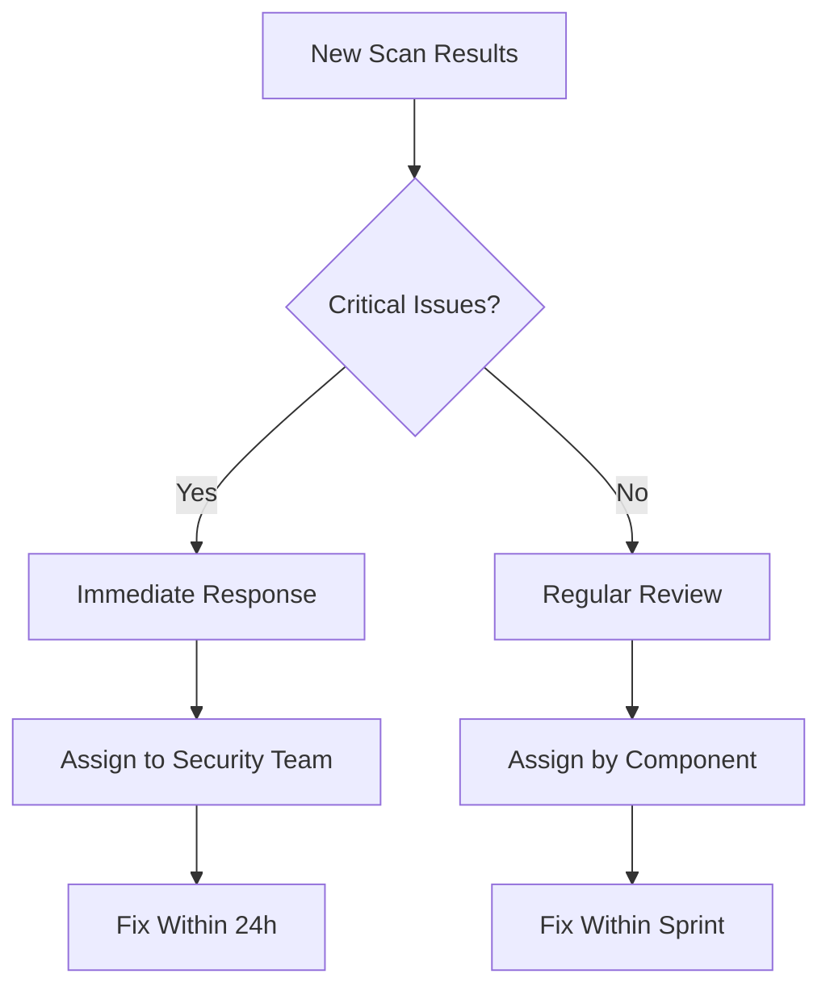

# Team Workflows and Collaboration

> Build effective team processes around AI Scanner to ensure security findings are addressed systematically, responsibilities are clear, and your entire development team contributes to maintaining secure code.

## Establishing Team Processes

### Security Review Workflow

Creating a systematic approach to handling AI Scanner results ensures nothing falls through the cracks:

#### 1. Scan Scheduling
- **Pre-deployment Scans** - Mandatory scans before production releases
- **Weekly Security Reviews** - Regular scans of active development branches
- **Pull Request Scans** - Scan feature branches before merging
- **Dependency Update Scans** - Scan after adding or updating packages

#### 2. Result Triage Process


#### 3. Issue Assignment Strategy

**By Severity Level**:
- **Critical/High** → Security team + Component owner
- **Medium** → Component owner
- **Low** → Include in technical debt backlog

**By Issue Type**:
- **Security Vulnerabilities** → Security team lead
- **Secret Exposure** → DevOps team + Security team
- **Code Quality** → Technical lead
- **Dependencies** → DevOps team

### Team Roles and Responsibilities

#### Security Champion
**Primary Responsibilities**:
- Review all Critical and High severity findings
- Coordinate response to security incidents
- Provide security guidance to development teams
- Maintain team security training and awareness

**Weekly Tasks**:
- Review new AI Scanner results across all repositories
- Update security issue tracking and metrics
- Conduct security-focused code reviews
- Plan security improvements and tool updates

#### Component Owners
**Primary Responsibilities**:
- Address security issues in their components
- Implement fixes following security guidelines
- Participate in security code reviews
- Maintain component-specific security documentation

**Per-Sprint Tasks**:
- Review AI Scanner findings for owned components
- Estimate and plan security fix work
- Implement fixes with security team guidance
- Update team on security improvements

#### Development Team
**Primary Responsibilities**:
- Follow secure coding practices
- Participate in security training
- Report potential security issues
- Support security testing and reviews

**Daily Tasks**:
- Write secure code following team guidelines
- Review security findings in their pull requests
- Ask security questions when uncertain
- Contribute to security culture and awareness

## Communication and Coordination

### Team Communication Channels

#### Slack Integration for Teams
Set up dedicated channels for different types of security communication:

**#security-alerts** - Critical Issues Only
- Critical vulnerabilities requiring immediate attention
- Secret exposures needing emergency response
- Security incidents and their resolution status
- Emergency security communications

**#security-reviews** - Regular Security Discussion
- Weekly AI Scanner result summaries
- Security code review discussions
- Security training announcements
- General security questions and guidance

**#dev-security** - Development Team Security
- Security-related pull request discussions
- Secure coding tips and best practices
- Tool updates and security enhancements
- Team security achievements and metrics

#### Email Notifications for Management
- **Weekly Security Summaries** - High-level metrics and trends
- **Monthly Security Reports** - Comprehensive security posture analysis
- **Incident Notifications** - Critical security events requiring attention
- **Compliance Updates** - Security compliance status and requirements

### Meeting Structures

#### Daily Security Standup (Critical Issues Only)
**Duration**: 10 minutes
**Participants**: Security team + Affected component owners
**Agenda**:
- Review any new Critical/High issues from overnight scans
- Status update on ongoing security fixes
- Blockers or assistance needed
- Plan for the day's security work

#### Weekly Security Review
**Duration**: 30 minutes
**Participants**: All development teams + Security champion
**Agenda**:
- Review AI Scanner metrics and trends
- Discuss completed security fixes
- Plan upcoming security work
- Share security learnings and best practices
- Address team security questions

#### Monthly Security Planning
**Duration**: 60 minutes
**Participants**: Technical leads + Security team + Management
**Agenda**:
- Review security posture improvements
- Plan security tooling and process improvements
- Discuss security training needs
- Set security goals for upcoming month
- Review compliance and audit requirements

## Tracking and Metrics

### Security Metrics Dashboard

Track key security indicators to measure improvement:

#### Vulnerability Metrics
- **Time to Detection** - How quickly vulnerabilities are found
- **Time to Resolution** - How quickly issues are fixed
- **Vulnerability Recurrence** - How often similar issues appear
- **Security Debt** - Backlog of unresolved security issues

#### Team Performance Metrics
- **Security Fix Velocity** - Rate of security issue resolution
- **Security Code Review Coverage** - Percentage of security-focused reviews
- **Security Training Completion** - Team security education status
- **Security Awareness Score** - Team security knowledge assessment

#### Code Quality Trends
- **Security Issue Density** - Issues per lines of code
- **Clean Scan Rate** - Percentage of scans with no critical issues
- **Secret Detection Rate** - Frequency of secret exposure
- **Dependency Security Score** - Third-party package security health

### Issue Tracking Integration

#### Jira/GitHub Issues Integration
Create structured workflows for tracking security work:

**Security Issue Template**:
```markdown
## Security Issue Details
**Severity**: [Critical/High/Medium/Low]
**Type**: [SQL Injection/XSS/Authentication/etc.]
**Component**: [Frontend/Backend/Database/etc.]
**CWE Category**: [CWE-XXX]

## Technical Details
**File**: [path/to/vulnerable/file.js]
**Line**: [Line number]
**Description**: [AI Scanner issue description]

## Impact Assessment
**Data at Risk**: [User data/Financial/System access/etc.]
**Exploitability**: [High/Medium/Low]
**Business Impact**: [Service disruption/Data breach/etc.]

## Remediation Plan
**Estimated Effort**: [Story points/Hours]
**Dependencies**: [Other issues/Teams/Tools needed]
**Testing Required**: [Unit/Integration/Security testing]

## Acceptance Criteria
- [ ] Vulnerability is fixed and verified
- [ ] Fix doesn't break existing functionality
- [ ] Security test cases are added
- [ ] Code review includes security focus
- [ ] AI Scanner confirms issue resolution
```

#### Sprint Planning Integration
- **Security Story Points** - Estimate security work alongside feature work
- **Security Acceptance Criteria** - Include security verification in all stories
- **Security Testing Tasks** - Explicit tasks for security testing
- **Security Review Gates** - Required security reviews before story completion

## Team Training and Development

### Security Education Program

#### Monthly Security Training Topics
1. **Secure Coding Basics** - Input validation, output encoding, authentication
2. **Framework Security** - React/Node.js/Python specific security practices
3. **Threat Modeling** - Understanding attacker perspectives and methods
4. **Incident Response** - How to respond to security issues and breaches
5. **Compliance Requirements** - GDPR, HIPAA, SOX, and other regulatory needs
6. **Tool Mastery** - Advanced AI Scanner features and security tooling

#### Hands-on Security Workshops
- **Vulnerability Labs** - Practice finding and fixing security issues
- **Code Review Sessions** - Group review of security-focused code changes
- **Red Team Exercises** - Simulated attacks on team applications
- **Security Tool Training** - Deep dives into AI Scanner and other tools

#### Knowledge Sharing Sessions
- **Security Show and Tell** - Team members present security improvements
- **Incident Retrospectives** - Learn from real security events
- **Industry Security News** - Discuss current threats and vulnerabilities
- **Best Practice Sharing** - Exchange security tips and techniques

### Building Security Champions

#### Security Champion Program
**Selection Criteria**:
- Strong technical skills and security interest
- Good communication and teaching abilities
- Respected team member with influence
- Commitment to security learning and improvement

**Champion Responsibilities**:
- Act as security point-of-contact for their team
- Provide first-level security guidance and review
- Escalate complex security issues to security team
- Lead team security training and awareness efforts

**Champion Support**:
- Advanced security training and certification
- Direct access to security team for consultation
- Recognition and career development opportunities
- Time allocation for security-focused work

#### Security Career Development
- **Security Learning Paths** - Structured progression through security topics
- **Certification Support** - Company support for security certifications
- **Conference Attendance** - Participation in security conferences and events
- **Internal Security Roles** - Opportunities to join security team

## Cross-Team Collaboration

### Security Integration Across Teams

#### Frontend Security Focus
- **XSS Prevention** - Output encoding and content security policies
- **Authentication UI** - Secure login and session management interfaces
- **Data Validation** - Client-side validation with server-side verification
- **Third-party Integrations** - Secure integration with external services

#### Backend Security Focus
- **API Security** - Authentication, authorization, rate limiting
- **Database Security** - Injection prevention, data encryption
- **Service Integration** - Secure communication between services
- **Infrastructure Security** - Secure deployment and configuration

#### DevOps Security Focus
- **Pipeline Security** - Secure CI/CD processes and secret management
- **Infrastructure Security** - Secure cloud configuration and monitoring
- **Dependency Management** - Package security and vulnerability tracking
- **Incident Response** - Security incident detection and response

### Shared Security Resources

#### Security Documentation Hub
- **Security Guidelines** - Team standards and best practices
- **Architecture Security** - Secure design patterns and principles
- **Incident Runbooks** - Step-by-step security incident response
- **Tool Documentation** - How-to guides for security tools and processes

#### Security Code Libraries
- **Common Security Functions** - Reusable secure coding components
- **Framework Extensions** - Security-enhanced framework components
- **Validation Libraries** - Input validation and sanitization functions
- **Authentication Modules** - Standardized authentication and authorization

#### Security Review Templates
- **Code Review Checklists** - Security-focused review criteria
- **Design Review Templates** - Security architecture review guides
- **Deployment Checklists** - Security verification before deployment
- **Incident Response Templates** - Structured incident documentation

## Measuring Success

### Team Security Maturity Assessment

#### Level 1: Basic Security Awareness
- Team understands basic security concepts
- AI Scanner is used regularly for scanning
- Critical issues are addressed promptly
- Basic secure coding practices are followed

#### Level 2: Proactive Security Culture
- Security is considered in design decisions
- Team proactively identifies security improvements
- Security training is regular and comprehensive
- Security metrics are tracked and improving

#### Level 3: Security Leadership
- Team contributes to organization security standards
- Security expertise is shared across organization
- Advanced security practices are routine
- Team leads security innovation and improvement

#### Level 4: Security Excellence
- Team is recognized as security leader
- Security practices are industry-leading
- Security culture influences entire organization
- Continuous security innovation and research

### Continuous Improvement Process
1. **Monthly Team Retrospectives** - Review security process effectiveness
2. **Quarterly Security Assessments** - Evaluate team security maturity
3. **Annual Security Strategy Planning** - Set long-term security goals
4. **Ongoing Process Refinement** - Continuously improve security workflows

Building effective team workflows around AI Scanner transforms security from an individual responsibility into a collaborative team effort, ensuring consistent security practices and continuous improvement across your entire development organization.

## Next Steps

<CardGroup cols={2}>
  <Card title="Start Scanning" icon="play" href="https://gammacode.dev/profile">
    Access AI Scanner and begin your team's security journey
  </Card>
  
  <Card title="Understanding Results" icon="chart-bar" href="/api-reference/endpoint/get">
    Learn how to interpret and act on scan findings
  </Card>
</CardGroup>